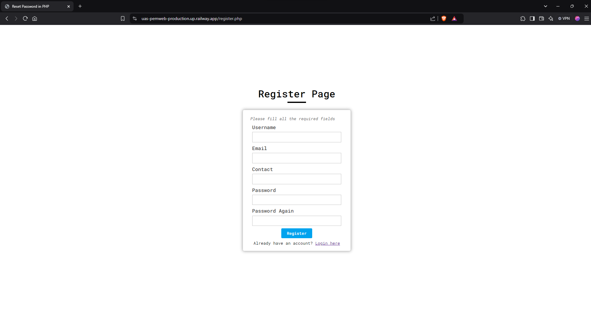
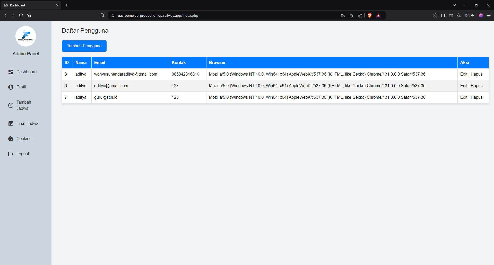
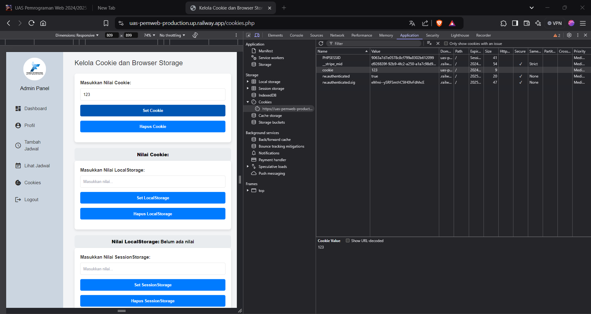

# UAS Pemweb

Link Hosting : https://uas-pemweb-production.up.railway.app/

### Nama : Aditya Wahyu Suhendar

### NIM : 122140235

### Kelas : RB

## Daftar Isi

- [Kriteria Penilaian](#kriteria-penilaian)
  - [1. Client-side Programming (30%)](#bagian-1--client-side-programming-bobot-30)
  - [2. Server-side Programming (30%)](#bagian-2-server-side-programming-bobot-30)
  - [3. Database Management (20%)](#bagian-3-database-management-bobot-20)
  - [4. State Management (20%)](#bagian-4-state-management-bobot-20)
  - [Bagian Bonus: Hosting Aplikasi Web (Bobot: 20%)](#bagian-bonus-hosting-aplikasi-web-bobot-20)

# Kriteria Penilaian

## Bagian 1 : Client-side Programming (Bobot: 30%)

### 1.1 Manipulasi DOM dengan JavaScript (15%)

- Buat form input dengan minimal 4 elemen input (teks, checkbox, radio, dll.)



- Tampilkan data dari server ke dalam sebuah tabel HTML.



### 1.2 Event Handling (15%)

- Tambahkan minimal 3 event yang berbeda untuk meng-handle form pada 1.1.
- Implementasikan JavaScript untuk validasi setiap input sebelum diproses oleh PHP.

```Javascript
<script>
    // 1. Event: Validasi saat input berubah (oninput)
    document.getElementById('email').addEventListener('input', function () {
        const email = this.value;
        const emailError = document.getElementById('email-error');

        if (!validateEmail(email)) {
            emailError.textContent = 'Please enter a valid email address.';
        } else {
            emailError.textContent = '';
        }
    });

    document.getElementById('password').addEventListener('input', function () {
        const password = this.value;
        const passwordError = document.getElementById('password-error');

        if (password.length < 6) {
            passwordError.textContent = 'Password must be at least 6 characters long.';
        } else {
            passwordError.textContent = '';
        }
    });

    // 2. Event: Validasi saat form disubmit (onsubmit)
    document.getElementById('login-form').addEventListener('submit', function (e) {
        const email = document.getElementById('email').value;
        const password = document.getElementById('password').value;
        const emailError = document.getElementById('email-error');
        const passwordError = document.getElementById('password-error');
        let isValid = true;

        if (!validateEmail(email)) {
            emailError.textContent = 'Please enter a valid email address.';
            isValid = false;
        } else {
            emailError.textContent = '';
        }

        if (password.length < 6) {
            passwordError.textContent = 'Password must be at least 6 characters long.';
            isValid = false;
        } else {
            passwordError.textContent = '';
        }

        if (!isValid) {
            e.preventDefault(); // Mencegah form dikirim jika tidak valid
        }
    });

    // 3. Event: Highlight input saat focus dan blur
    const inputs = document.querySelectorAll('#login-form input');
    inputs.forEach(input => {
        input.addEventListener('focus', function () {
            this.style.borderColor = '#007BFF';
        });
        input.addEventListener('blur', function () {
            this.style.borderColor = '';
        });
    });

    // Fungsi untuk validasi email
    function validateEmail(email) {
        const emailRegex = /^[^\s@]+@[^\s@]+\.[^\s@]+$/;
        return emailRegex.test(email);
    }
</script>
```

## Bagian 2: Server-side Programming (Bobot: 30%)

### 2.1 Pengelolaan Data dengan PHP (20%)

- Gunakan metode POST atau GET pada formulir.

```php
if ($_SERVER['REQUEST_METHOD'] == 'POST') {
    // Ambil data dari form
    $email = trim($_POST['email'] ?? '');
    $password = trim($_POST['password'] ?? '');

    // Validasi input
    if (empty($email) || empty($password)) {
        $error = "Please fill in all required fields.";
    } else {
        // Query untuk mencari pengguna berdasarkan email
        $stmt = $conn->prepare("SELECT * FROM `users` WHERE `email` = ?");
        $stmt->bind_param('s', $email);
        $stmt->execute();
        $result = $stmt->get_result();

        if ($result->num_rows > 0) {
            $user = $result->fetch_assoc();
            // Verifikasi password
            if (password_verify($password, $user['password'])) {
                // Simpan data pengguna ke session
                $_SESSION['user_id'] = $user['id']; // Simpan user ID
                $_SESSION['username'] = $user['username']; // Simpan username
                $_SESSION['email'] = $user['email']; // Simpan email
                $_SESSION['contact'] = $user['contact'] ?? null; // Simpan contact jika ada
                $_SESSION['msg']['success'] = "You have logged in successfully.";

                // Redirect ke halaman index.php
                header('location: index.php');
                exit;
            } else {
                $error = "Incorrect Email or Password.";
            }
        } else {
            $error = "Incorrect Email or Password.";
        }
    }
}

```


- Parsing data dari variabel global dan lakukan validasi di sisi server.

```php
if (password_verify($password, $user['password'])) {
                // Simpan data pengguna ke session
                $_SESSION['user_id'] = $user['id']; // Simpan user ID
                $_SESSION['username'] = $user['username']; // Simpan username
                $_SESSION['email'] = $user['email']; // Simpan email
                $_SESSION['contact'] = $user['contact'] ?? null; // Simpan contact jika ada
                $_SESSION['msg']['success'] = "You have logged in successfully.";

                // Redirect ke halaman index.php
                header('location: index.php');
                exit;
            } else {
                $error = "Incorrect Email or Password.";
            }
        } else {
            $error = "Incorrect Email or Password.";
        }
    }
}

```

- Simpan ke basis data termasuk jenis browser dan alamat IP pengguna.

Setelah di validasi Insert ke database [auth_controller.php](./app/controller/auth/auth_controller.php)

```php

```

### 2.2 Objek PHP Berbasis OOP (10%)

- Buat sebuah objek PHP berbasis OOP yang memiliki minimal dua metode dan gunakan objek tersebut dalam skenario tertentu.

```php
class Auth
{
    private $currentPage;

    public function __construct()
    {
        session_start();
        $this->currentPage = basename($_SERVER["PHP_SELF"]);
        $this->disableCaching();
    }

    private function disableCaching()
    {
        header("Expires: Tue, 01 Jan 2000 00:00:00 GMT"); // Waktu kadaluwarsa di masa lalu
        header("Last-Modified: " . gmdate("D, d M Y H:i:s") . " GMT"); // Selalu diperbarui
        header("Cache-Control: no-store, no-cache, must-revalidate, max-age=0");
        header("Cache-Control: post-check=0, pre-check=0", false);
        header("Pragma: no-cache");
    }

    public function handleAuthentication()
    {
        switch ($this->currentPage) {
            case 'index.php':
                $this->requireAuthentication();
                break;

            case 'login.php':
            case 'reset-password.php':
            case 'forgot-password.php':
                $this->redirectIfAuthenticated();
                break;

            case 'logout.php':
                $this->logout();
                break;

            default:
                // No specific authentication logic required for other pages
                break;
        }
    }

    private function requireAuthentication()
    {
        if (!isset($_SESSION['user_id']) || $_SESSION['user_id'] <= 0) {
            header('Location: login.php');
            exit;
        }
    }

    private function redirectIfAuthenticated()
    {
        if (isset($_SESSION['user_id']) && $_SESSION['user_id'] > 0) {
            header('Location: index.php');
            exit;
        }
    }

    private function logout()
    {
        session_unset(); // Hapus semua data sesi
        session_destroy(); // Hancurkan sesi
        header("Expires: Tue, 01 Jan 2000 00:00:00 GMT"); // Pastikan halaman kadaluwarsa
        header("Location: login.php");
        exit;
    }
}

$auth = new Auth();
$auth->handleAuthentication();
?>

```

## Bagian 3: Database Management (Bobot: 20%)

### 3.1 Pembuatan Tabel Database (5%)

```sql
CREATE TABLE `users` (
  `id` int(11) NOT NULL,
  `username` varchar(50) NOT NULL,
  `email` varchar(100) NOT NULL,
  `contact` varchar(15) DEFAULT NULL,
  `password` varchar(255) NOT NULL,
  `created_at` timestamp NOT NULL DEFAULT current_timestamp()
) ENGINE=InnoDB DEFAULT CHARSET=utf8mb4 COLLATE=utf8mb4_general_ci;

CREATE TABLE `schedules` (
  `id` int(11) NOT NULL,
  `subject_name` varchar(100) NOT NULL,
  `teacher_name` varchar(100) NOT NULL,
  `day_of_week` varchar(20) NOT NULL,
  `time_start` time NOT NULL,
  `time_end` time NOT NULL,
  `created_at` timestamp NOT NULL DEFAULT current_timestamp()
) ENGINE=InnoDB DEFAULT CHARSET=utf8mb4 COLLATE=utf8mb4_general_ci;
```

### 3.2 Konfigurasi Koneksi Database (5%)

```php
class Database
{
    private $connection;

    public function __construct($host, $username, $password, $dbname)
    {
        $this->connect($host, $username, $password, $dbname);
    }

    private function connect($host, $username, $password, $dbname)
    {
        try {
            $this->connection = new mysqli($host, $username, $password, $dbname);
            if ($this->connection->connect_error) {
                throw new Exception("Database connection failed: " . $this->connection->connect_error);
            }
        } catch (Exception $e) {
            die($e->getMessage());
        }
    }

    public function getConnection()
    {
        return $this->connection;
    }
}

// Konfigurasi database
$dbConfig = [
    'host' => "localhost",
    'username' => "root",
    'password' => "",
    'dbname' => "reset"
];

// Inisialisasi koneksi database
$database = new Database($dbConfig['host'], $dbConfig['username'], $dbConfig['password'], $dbConfig['dbname']);
?>


```

### 3.3 Manipulasi Data pada Database (10%)


## Bagian 4: State Management (Bobot: 20%)

### 4.1 State Management dengan Session (10%)

- Gunakan session_start() untuk memulai session.

```php
class Auth
{
    private $currentPage;

    public function __construct()
    {
        session_start();
        $this->currentPage = basename($_SERVER["PHP_SELF"]);
        $this->disableCaching();
    }

    private function disableCaching()
    {
        header("Expires: Tue, 01 Jan 2000 00:00:00 GMT"); // Waktu kadaluwarsa di masa lalu
        header("Last-Modified: " . gmdate("D, d M Y H:i:s") . " GMT"); // Selalu diperbarui
        header("Cache-Control: no-store, no-cache, must-revalidate, max-age=0");
        header("Cache-Control: post-check=0, pre-check=0", false);
        header("Pragma: no-cache");
    }

    public function handleAuthentication()
    {
        switch ($this->currentPage) {
            case 'index.php':
                $this->requireAuthentication();
                break;

            case 'login.php':
            case 'reset-password.php':
            case 'forgot-password.php':
                $this->redirectIfAuthenticated();
                break;

            case 'logout.php':
                $this->logout();
                break;

            default:
                // No specific authentication logic required for other pages
                break;
        }
    }

    private function requireAuthentication()
    {
        if (!isset($_SESSION['user_id']) || $_SESSION['user_id'] <= 0) {
            header('Location: login.php');
            exit;
        }
    }

    private function redirectIfAuthenticated()
    {
        if (isset($_SESSION['user_id']) && $_SESSION['user_id'] > 0) {
            header('Location: index.php');
            exit;
        }
    }

    private function logout()
    {
        session_unset(); // Hapus semua data sesi
        session_destroy(); // Hancurkan sesi
        header("Expires: Tue, 01 Jan 2000 00:00:00 GMT"); // Pastikan halaman kadaluwarsa
        header("Location: login.php");
        exit;
    }
}

$auth = new Auth();
$auth->handleAuthentication();
?>

- Simpan informasi pengguna ke dalam session.

### 4.2 Pengelolaan State dengan Cookie dan Browser Storage (10%)

- Buat fungsi untuk menetapkan, mendapatkan, dan menghapus cookie.
```
```Javascript
<script>
        document.addEventListener("DOMContentLoaded", () => {
            const cookieInput = document.getElementById("cookieInput");
            const localStorageInput = document.getElementById("localStorageInput");
            const sessionStorageInput = document.getElementById("sessionStorageInput");

            const cookieDisplay = document.getElementById("cookieDisplay");
            const localStorageDisplay = document.getElementById("localStorageDisplay");
            const sessionStorageDisplay = document.getElementById("sessionStorageDisplay");

            function updateDisplays() {
                const cookies = document.cookie.split("; ").reduce((acc, cookie) => {
                    const [key, value] = cookie.split("=");
                    acc[key] = value;
                    return acc;
                }, {});
                cookieDisplay.textContent = cookies.cookie || "Belum ada nilai";
                localStorageDisplay.textContent = localStorage.getItem("localStorage") || "Belum ada nilai";
                sessionStorageDisplay.textContent = sessionStorage.getItem("sessionStorage") || "Belum ada nilai";
            }

            document.getElementById("setCookie").addEventListener("click", () => {
                const value = cookieInput.value.trim();
                if (!value) {
                    alert("Masukkan nilai terlebih dahulu!");
                    return;
                }
                document.cookie = `cookie=${value}; path=/; max-age=3600`;
                updateDisplays();
            });

            document.getElementById("deleteCookie").addEventListener("click", () => {
                document.cookie = "cookie=; path=/; max-age=0";
                updateDisplays();
            });

            document.getElementById("setLocalStorage").addEventListener("click", () => {
                const value = localStorageInput.value.trim();
                if (!value) {
                    alert("Masukkan nilai terlebih dahulu!");
                    return;
                }
                localStorage.setItem("localStorage", value);
                updateDisplays();
            });

            document.getElementById("deleteLocalStorage").addEventListener("click", () => {
                localStorage.removeItem("localStorage");
                updateDisplays();
            });

            document.getElementById("setSessionStorage").addEventListener("click", () => {
                const value = sessionStorageInput.value.trim();
                if (!value) {
                    alert("Masukkan nilai terlebih dahulu!");
                    return;
                }
                sessionStorage.setItem("sessionStorage", value);
                updateDisplays();
            });

            document.getElementById("deleteSessionStorage").addEventListener("click", () => {
                sessionStorage.removeItem("sessionStorage");
                updateDisplays();
            });

            updateDisplays();
        });
    </script>
    
```

- Gunakan browser storage untuk menyimpan informasi secara lokal.




### Bagian Bonus: Hosting Aplikasi Web (Bobot: 20%)

- (5%) Apa langkah-langkah yang Anda lakukan untuk meng-host aplikasi web Anda?

1. Mencari penyedia hosting (railway)
2. Login Railway menggunakan github
3. Pilih project yang ingin di-host
4. Buat mysql pada railway
5. Sesuaikan variable database pada code
6. Push code ke github
7. Deploy ke railway (Otomatis oleh Railway jika sudah terhubung ke github)

- (5%) Pilih penyedia hosting web yang menurut Anda paling cocok untuk aplikasi web Anda.

  Saya menggunakan penyedia hosting web https://railway.com/ karena memiliki layanan yang gratis (Trial)

- (5%) Bagaimana Anda memastikan keamanan aplikasi web yang Anda host?

  Railway memungkinkan saya mengelola deployment aplikasi dengan baik. Saya dapat melakukan rollback ke versi sebelumnya jika ada masalah, atau me-restart layanan untuk menjaga aplikasi tetap berjalan dengan aman.

- (5%) Jelaskan konfigurasi server yang Anda terapkan untuk mendukung aplikasi web Anda.

  Pertama-tama saya buka platform railway nya kemudian saya login menggunakan github agar ketika saya push code ke github maka otomatis akan terdeploy ke railway. Kemudian saya konfiguri database saya menggunakan database mysql. Setelah itu saya konfigurasi environment variable yang saya butuhkan seperti host, password, database, dsb, setelah sama maka otomatis bisa diakses railwaynya. Berikut adalah link railway yang sudah saya hosting https://uas-pemweb-production.up.railway.app/
